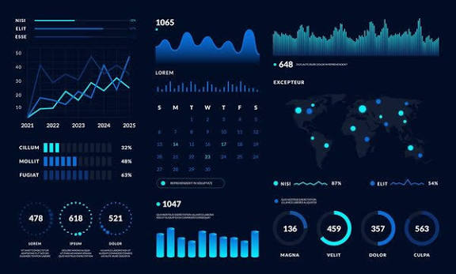

# 🚀 Project Portfolio

Welcome to my project website. This portfolio showcases my latest work, ongoing developments, and completed projects.

---

# 📌 About This Site

| Information | Details |
|-------------|---------|
| **Purpose** | Showcase software, data analytics, and visualization projects. |
| **Includes** | Python • SQL • Power BI • Excel • Documentation |
| **Updated** | Regularly with new projects and improvements |
| **Repository** | GitHub Pages Portfolio |

---

# ⭐ Latest Project

## Project Name

Write a short description of your latest project here.

### Technologies
Python • SQL • Power BI • Excel

### Repository

🔗 https://github.com/lenovosoftware00/datastructure_website

---

# 🚧 Current Project

## Project Name

Describe your current project.

**Status**

🟡 In Progress

### Repository

🔗 https://github.com/lenovosoftware00/datastructure_website

---

# 📁 Fifth Project

## Project Name

Add the description of your fifth project here.

**Technology**

Python • SQL • Excel

🔗 https://github.com/YOUR_USERNAME/FIFTH_PROJECT

---

# 📁 Fourth Project

## Project Name

Add the description of your fourth project here.

**Technology**

SQL • Power BI

🔗 https://github.com/YOUR_USERNAME/FOURTH_PROJECT

---

# 📁 Third Project

## Project Name

Add the description of your third project here.

**Technology**

Python • Pandas • Matplotlib

🔗 https://github.com/YOUR_USERNAME/THIRD_PROJECT

---

# 📈 Portfolio Statistics

| Category | Count |
|----------|------:|
| Completed Projects | **05** |
| Ongoing Projects | **01** |
| Programming Languages | **05+** |
| Tools & Technologies | **10+** |

---

# 🛠 Technologies

| Programming | Database | Visualization | Version Control |
|------------|----------|---------------|----------------|
| Python | MySQL | Power BI | Git |
| SQL | PostgreSQL | Excel | GitHub |

---

# 📬 Contact

| Platform | Link |
|----------|------|
| GitHub | https://github.com/YOUR_USERNAME |
| Portfolio | https://YOUR_USERNAME.github.io |
| LinkedIn | https://linkedin.com/in/YOUR_USERNAME |
| Email | your_email@example.com |

---

## ⭐ Thank You for Visiting

Feel free to explore my projects and connect with me.

